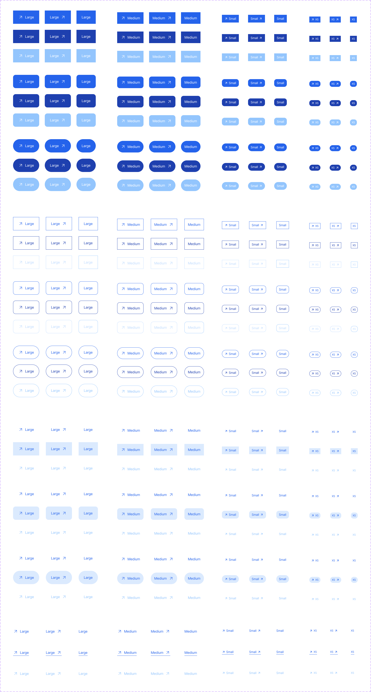

# Reusable Button (Next.js + Tailwind)

Tiny **Primary Button** component with fixed sizes matching Figma.  
Typed API, Tailwind-friendly, easy to extend.



## Quick start
```bash
npm i
npm i clsx tailwind-merge
npm run dev
# open http://localhost:3000
```

## Usage
```tsx
import BaseButton from "@/components/BaseButton";
import Image from "next/image";

const Arrow = () => (
  <Image src="/SystemIcons.svg" alt="" width={24} height={24} aria-hidden />
);

export default function Demo() {
  return (
    <div className="grid grid-cols-1 sm:grid-cols-3 gap-4">
      <BaseButton text="Large" hierarchy="primary" size="lg" icon={<Arrow />} />
      <BaseButton text="Large" hierarchy="primary" size="lg" icon={<Arrow />} iconPosition="right" />
      <BaseButton text="Large" hierarchy="primary" size="lg" />
    </div>
  );
}
```

## Props (common)
`text`, `hierarchy` (`primary|secondary|tertiary`), `size` (`lg|md|sm|xs`),  
`radius` (`square|rounded|circle`), `icon` / `iconPosition` (`left|right`),  
`disabled`, `isLoading`, `className`, `buttonType`.

## Figma sizes (Primary)
- **Large**: `122×62` (with icon) / `90×62` (no icon)  
- **Medium**: `123×54` (with icon) / `91×54` (no icon)

## Files
```
src/components/BaseButton.tsx
src/utils/cn.ts           # twMerge(clsx(...))
public/SystemIcons.svg
public/referenceButtons.png
```

## License
MIT
